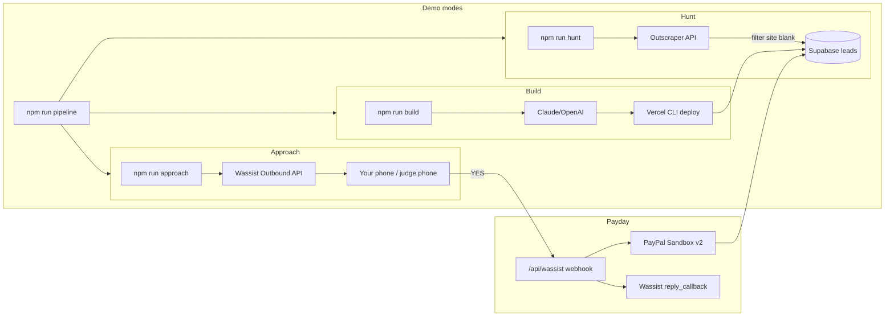

# Hands Off Web Agency — Execution Plan

Hackathon edition for the Cursor Hands Off London Hackathon. Script-first pipeline: hunt London leads → generate sites → WhatsApp outreach → PayPal checkout.

## What you decided

| Decision | Choice |
|----------|--------|
| Ready now | Supabase, PayPal Sandbox, Wassist |
| Orchestration | **Script-first** (not Manus) |
| Demo style | **Best feasible** → semi-auto primary, staged fallback |
| Leads | London local businesses, no website |
| Reply flow | Wassist inbound webhook → auto-trigger PayPal |
| Timeline | **Fast** |

## Architecture



**Why Node/TypeScript (not Python/Modal):** Vercel + Wassist webhooks fit one repo. The CLI orchestrator and public webhook endpoint both live on Vercel — no ngrok, no second runtime.

**Why semi-auto demo (not fully hands-off):** `npm run pipeline` runs Hunt → Build → Approach unattended. The only human step is replying YES on WhatsApp — which is the product demo. Staged commands (`hunt`, `build`, `approach`) remain available if something fails live.

---

## Accounts to set up from scratch (~30 min)

1. **Outscraper** — [app.outscraper.com](https://app.outscraper.com) → API key. Free tier is enough for demo (scrape 10–20 leads, use 2–3 live).
   - **Important:** API has no server-side "no website" filter; filter client-side where `site` is empty/null ([Outscraper community confirms](https://community.outscraper.com/t/quick-filters-website-phone-operational-verified-available-in-async-maps-api/854)).
   - Query example: `"plumbers in Camden, London, UK"` with `limit: 20`.

2. **Vercel** — Account + CLI:

   ```bash
   npm i -g vercel && vercel login
   ```

   Generate a token for headless deploys (`VERCEL_TOKEN`).

3. **LLM API** — Pick one for site generation:
   - **Anthropic** (Claude) or **OpenAI** (GPT-4o). The pipeline script needs a direct API key.

4. **Wassist templates** (required for outbound) — Per [Wassist Outbound API](https://wassist.app/blog/outbound-message-api/), cold WhatsApp needs **pre-approved templates**:
   - Template A: outreach with `{{name}}` + `{{deployment_url}}`
   - Template B: payment with `{{paypal_link}}`
   - Create both in Wassist dashboard before coding.

5. **Wassist BYOA webhook** — Register your deployed URL via [BYOA agent API](https://docs.wassist.app/concepts/bring-your-own-agent) so inbound YES replies hit `/api/wassist`.

**Skip for v1:** Manus AI, Apify (unless Outscraper signup fails), Modal.

---

## Repo structure

```
cursorhand-hack/
├── package.json
├── tsconfig.json
├── .env.example
├── vercel.json
├── api/
│   └── wassist.ts          # Vercel serverless webhook
├── src/
│   ├── cli.ts              # Commander entry: hunt | build | approach | pipeline
│   ├── pipeline/
│   │   ├── hunt.ts
│   │   ├── build.ts
│   │   ├── approach.ts
│   │   └── payday.ts
│   └── lib/
│       ├── supabase.ts
│       ├── outscraper.ts
│       ├── llm.ts
│       ├── deploy.ts       # write temp dir → vercel deploy --prod
│       ├── wassist.ts
│       └── paypal.ts
├── prompts/
│   └── site-generation.md
└── supabase/
    └── schema.sql
```

---

## Supabase schema

Single `leads` table as state machine:

```sql
create type lead_status as enum (
  'NEW', 'BUILDING', 'SITE_READY', 'CONTACTED', 'INTERESTED', 'INVOICED', 'PAID', 'FAILED'
);

create table leads (
  id uuid primary key default gen_random_uuid(),
  name text not null,
  full_address text,
  phone text not null,
  niche text,
  google_place_id text,
  status lead_status default 'NEW',
  deployment_url text,
  paypal_order_id text,
  paypal_checkout_url text,
  wassist_reply_callback text,  -- store for follow-up within 24h
  error_message text,
  created_at timestamptz default now(),
  updated_at timestamptz default now()
);
```

**Demo safety:** Seed 2 backup London leads manually (`status = NEW`, real phone you control) so Hunt can be skipped if Outscraper is slow.

---

## Phase-by-phase implementation

### Phase 1 — Hunt (`src/pipeline/hunt.ts`)

1. Call Outscraper `maps/search-v3` with London query + `limit: 20`.
2. Client-side filter: `!row.site || row.site.trim() === ''`.
3. Require `phone` present.
4. Upsert into Supabase with `status = NEW`, dedupe by `phone` or `google_place_id`.
5. CLI: `npm run hunt -- --query "cafes in Shoreditch, London"`

### Phase 2 — Build (`src/pipeline/build.ts`)

1. Fetch leads where `status = NEW` (limit 1 for live demo, 3 for batch).
2. Set `status = BUILDING`.
3. LLM prompt (`prompts/site-generation.md`): business name, address, niche → **single `index.html`** with Tailwind CDN (not React — faster to generate, fewer deploy failures).
4. Write to `/tmp/site-{leadId}/index.html`.
5. Deploy via `vercel deploy --prod --yes --token $VERCEL_TOKEN` from that directory.
6. Save `deployment_url`, set `status = SITE_READY`.

**Demo moment:** Stream LLM output to terminal or open generated HTML in editor before deploy.

### Phase 3 — Approach (`src/pipeline/approach.ts`)

1. Fetch `status = SITE_READY`.
2. Call Wassist Outbound API with approved template + variables `{ name, deployment_url }`.
3. Set `status = CONTACTED`.

Message (template body): *"Hi {{name}}, I noticed you don't have a website. I built this for you: {{deployment_url}}. Interested?"*

### Phase 4 — Payday (`api/wassist.ts` + `src/pipeline/payday.ts`)

**Webhook handler** ([Wassist BYOA docs](https://docs.wassist.app/concepts/bring-your-own-agent)):

1. Receive POST: `{ message, phone_number, reply_callback }`.
2. Match `phone_number` to a lead with `status = CONTACTED`.
3. Intent check: message matches `/\b(yes|yeah|yep|interested|sure)\b/i`.
4. Store `reply_callback` on the lead.
5. Create PayPal Sandbox order ($99 "Website Setup") via **REST v2** (`/v2/checkout/orders`) — avoid deprecated `paypal-rest-sdk`.
6. Save `paypal_checkout_url`, set `status = INVOICED`.
7. POST to `reply_callback`: *"Great! Claim your site here: {{paypal_link}}"*
8. On demo completion (manual or PayPal webhook): set `status = PAID`.

**First response from webhook:** return `{ content: "..." }` only if you want an immediate ack; payment link goes via `reply_callback` after order creation.

---

## Demo script (5 minutes, judge-facing)

| Minute | Action | Screen |
|--------|--------|--------|
| 0:00 | `npm run pipeline` | Terminal + Supabase dashboard |
| 0:30 | Walk away | Leads appear in Supabase (`NEW` → `SITE_READY`) |
| 1:30 | Show generated site URL on phone | Live Vercel deployment |
| 2:00 | WhatsApp arrives (outreach) | Your phone |
| 2:30 | Reply "YES" | Webhook fires → PayPal link arrives |
| 3:30 | Complete PayPal Sandbox checkout | Payment success screen |
| 4:30 | Supabase shows `PAID` | Mic drop |

**Fallback if live scrape fails:** `npm run hunt -- --seed` uses pre-seeded leads; or run `build` → `approach` only.

---

## Environment variables (`.env.example`)

```
SUPABASE_URL=
SUPABASE_SERVICE_ROLE_KEY=
OUTSCRAPER_API_KEY=
ANTHROPIC_API_KEY=          # or OPENAI_API_KEY
VERCEL_TOKEN=
PAYPAL_CLIENT_ID=
PAYPAL_CLIENT_SECRET=
PAYPAL_MODE=sandbox
WASSIST_API_KEY=
WASSIST_OUTBOUND_SECRET=
WASSIST_OUTBOUND_TEMPLATE_OUTREACH_ID=
WASSIST_OUTBOUND_TEMPLATE_PAYMENT_ID=
WEBHOOK_BASE_URL=           # e.g. https://cursorhand-hack.vercel.app
```

---

## Risk mitigations (hackathon-critical)

| Risk | Mitigation |
|------|------------|
| Outscraper slow / no results | Pre-seed 2 leads; client-side filter; small `limit` |
| Wassist template not approved | Create templates **first**; test outbound with your own number before demo |
| Vercel deploy fails | Validate HTML locally; deploy 1 site in rehearsal |
| Webhook unreachable locally | Deploy API to Vercel before demo; never rely on localhost |
| PayPal SDK confusion | Use REST v2 curl-tested order creation in rehearsal |
| YES not detected | Fuzzy regex + log all inbound messages to Supabase |

---

## Build order (fastest path to working demo)

1. Supabase schema + seed 2 test leads
2. `hunt.ts` + Outscraper (verify 1 real London lead)
3. `build.ts` + LLM + Vercel deploy (1 site end-to-end)
4. Wassist outbound template + `approach.ts` (message to your phone)
5. Deploy webhook to Vercel + `payday.ts` (YES → PayPal link)
6. Wire `pipeline` command + rehearse full flow once

**Defer:** PayPal payment confirmation webhook, admin UI, batch processing, React sites, Manus integration.

---

## Implementation checklist

- [ ] Sign up Outscraper, Vercel CLI, LLM API; create 2 Wassist WhatsApp templates (outreach + payment)
- [ ] Create leads table + seed 2 backup London test leads in Supabase
- [ ] Scaffold Node/TS project: CLI, lib modules, `.env.example`, `vercel.json`
- [ ] Implement `hunt.ts`: Outscraper fetch, client-side no-website filter, Supabase upsert
- [ ] Implement `build.ts`: LLM site generation, temp dir, Vercel CLI deploy
- [ ] Implement `approach.ts`: Wassist outbound template send, status CONTACTED
- [ ] Implement `/api/wassist` webhook + `payday.ts`: YES detection, PayPal v2 order, reply_callback
- [ ] Wire `npm run pipeline` + rehearse full Hunt → Build → Approach → YES → PayPal demo once

---

## Key changes from original draft

- **Dropped Manus** as orchestrator → script-first
- **Dropped Modal** → Vercel hosts webhook + deploys sites
- **Single HTML + Tailwind CDN** instead of React (faster, more reliable)
- **Outscraper client-side filter** documented (API limitation)
- **PayPal REST v2** instead of `paypal-rest-sdk`
- **Wassist templates** called out explicitly (easy to miss, blocks outbound)
